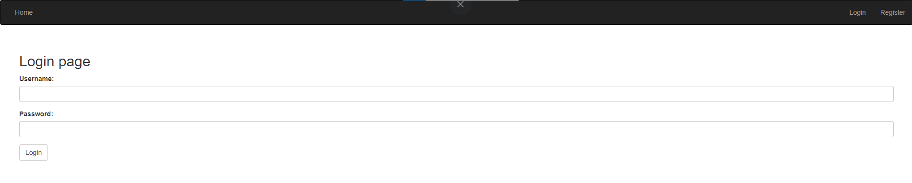

# User Tasks API Documentation
This is the API documentation where you will be able to find information on all information about the "*User Tasks*" project.

Deploy on Vercel: https://user-tasks-opdyed1ry-emil-stoychev.vercel.app/

## Used dependencies:
- react
- react-dom
- react-router-dom
- react-input-emoji
- awesome-snackbar
- bcrypt
- bootstrap
- joi
- jsonwebtoken
- next

### Instalation and start client in my-app folder:

### To install all dependencies
```bash
npm i
```

### To start application
```bash
npm run dev
```

# Introduction
Welcome to User Tasks App! here you can easily and quickly create, edit and track your tasks for the day!

### Different pages
  - Home
  - Create
  - Profile
  - Login
  - Register
  
# How it works

- [x] **Home (guest)**

Every ```guest``` can see a Welcome page with welcome message.


- [x] **Home (user)**

Every ```user``` can see a Welcome page with different buttons like Create, Sort and Search field.


```edit```


- [x] **Create**


- [x] **Profile**


```profile edit```


```login```



```register```


## END

